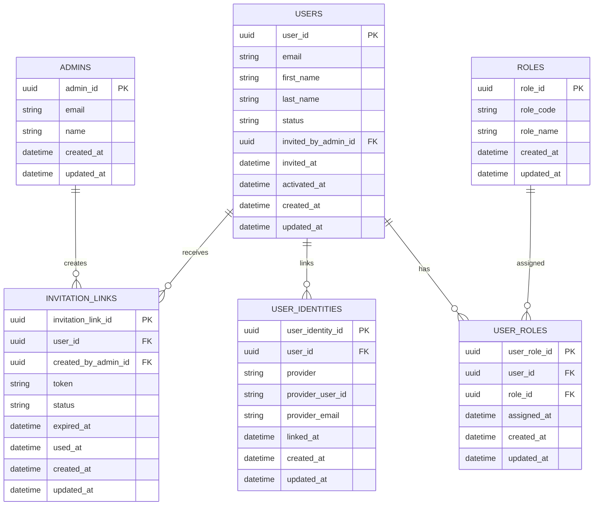

```mermaid
erDiagram

    ADMINS ||--o{ INVITATION_LINKS : creates
    USERS ||--o{ INVITATION_LINKS : receives
    USERS ||--o{ USER_IDENTITIES : links
    USERS ||--o{ USER_ROLES : has
    ROLES ||--o{ USER_ROLES : assigned

    ADMINS {
        uuid admin_id PK
        string email
        string name
        datetime created_at
        datetime updated_at
    }

    USERS {
        uuid user_id PK
        string email
        string first_name
        string last_name
        string status
        uuid invited_by_admin_id FK
        datetime invited_at
        datetime activated_at
        datetime created_at
        datetime updated_at
    }

    INVITATION_LINKS {
        uuid invitation_link_id PK
        uuid user_id FK
        uuid created_by_admin_id FK
        string token
        string status
        datetime expired_at
        datetime used_at
        datetime created_at
        datetime updated_at
    }

    USER_IDENTITIES {
        uuid user_identity_id PK
        uuid user_id FK
        string provider
        string provider_user_id
        string provider_email
        datetime linked_at
        datetime created_at
        datetime updated_at
    }

    ROLES {
        uuid role_id PK
        string role_code
        string role_name
        datetime created_at
        datetime updated_at
    }

    USER_ROLES {
        uuid user_role_id PK
        uuid user_id FK
        uuid role_id FK
        datetime assigned_at
        datetime created_at
        datetime updated_at
    }
```
